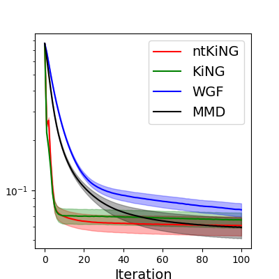
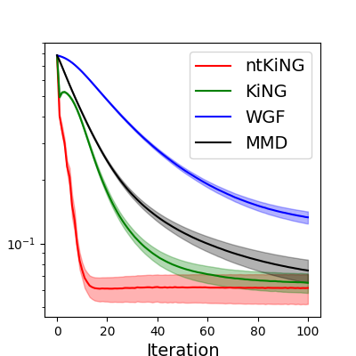

# iNGD
The code for algorithms in https://arxiv.org/abs/2502.07650

To reproduce the convergence plot 
```shell
python src/paper_demo_mixture.py 5 10 # 5 dimnensional, 10 trials
python src/paper_demo_mixture.py 20 10  # 20 dimensional, 10 tirals
```

## results 
res/mixture_5d.png



res/mixture_20d.png

